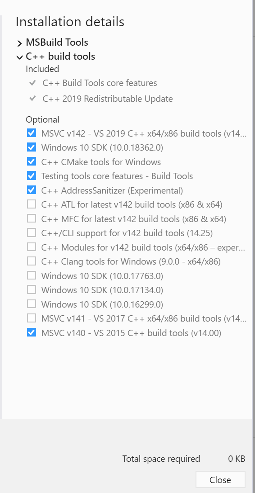

# Teaching Minitaur How to Walk using DDPG with Rainbow Extensions

### Directory Layout

    .
    ├── main.py                 # Driver script for training using DDPG
    ├── runs                    # Latest results for each DQN Extension / Modification
    ├── assets                  # Images for results and other supporting material
    ├── saves                   # Latest models for each DQN Extension / Modification
    ├── lib                     # Libraries / Wrapper used by main script
    └── README.md


### To Run DDPG Training:

```sh
python main.py -n=<run name>
```

#### For example:

```sh
python main.py -n=firstrun
```

## To Run DDPG Training with a DQN Extension:

```sh
python main.py -n=<run name> --extension=<extension name>
```

Available extensions: double, nstep, noisy

### For example:
```sh
python main.py -n=<run name> --extension=nstep
```
_________________
## Setting up Windows environment:

1. install Anaconda from the following link https://www.anaconda.com/downloads

2. install pytorch 1.3.0
```sh
pip install torch==1.3.0+cu92 -f https://download.pytorch.org/whl/torch_stable.html
```

3. install ptan, gym, numpy, tensorboard

```sh
pip install ptan gym numpy tensorboard
```

4. install pybullet

```sh
pip install pybullet
```

You might get an error 'error: Microsoft Visual C++ 14.0 is required. Get it with "Build Tools for Visual Studio"', in which case Visual Studio Build tools must be installed which can be downloaded from "https://visualstudio.microsoft.com/visual-cpp-build-tools/". Install the following packages...



You may have to restart your machine to complete the installation.

